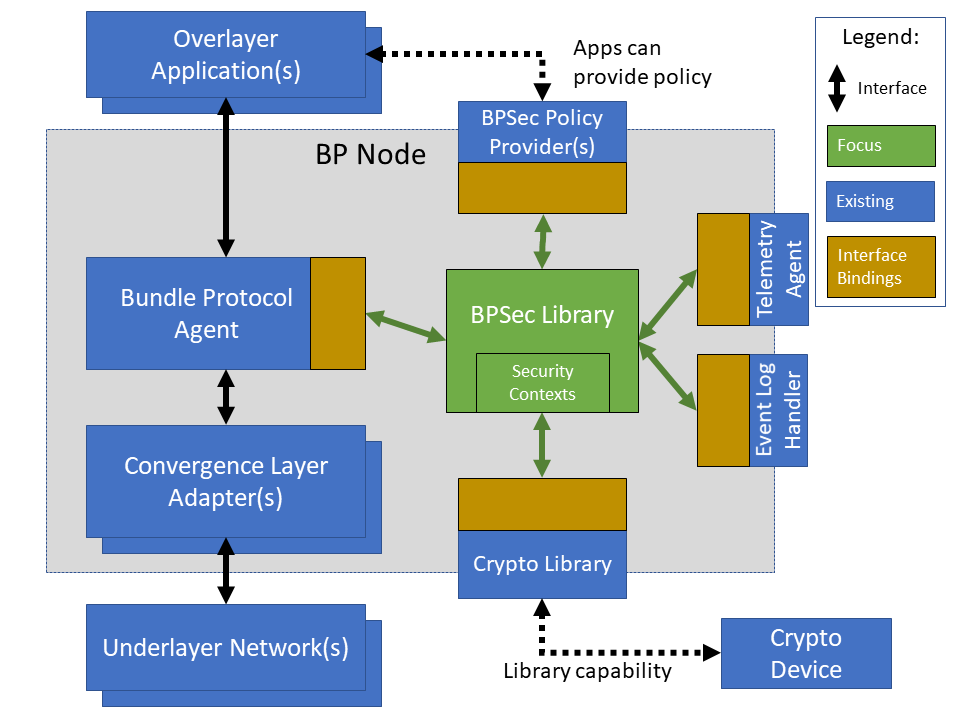

////
Copyright (c) 2023-2025 The Johns Hopkins University Applied Physics
Laboratory LLC.

This file is part of the Bundle Protocol Security Library (BSL).

Licensed under the Apache License, Version 2.0 (the "License");
you may not use this file except in compliance with the License.
You may obtain a copy of the License at
    http://www.apache.org/licenses/LICENSE-2.0
Unless required by applicable law or agreed to in writing, software
distributed under the License is distributed on an "AS IS" BASIS,
WITHOUT WARRANTIES OR CONDITIONS OF ANY KIND, either express or implied.
See the License for the specific language governing permissions and
limitations under the License.

This work was performed for the Jet Propulsion Laboratory, California
Institute of Technology, sponsored by the United States Government under
the prime contract 80NM0018D0004 between the Caltech and NASA under
subcontract 1700763.
////
= Bundle Protocol Security Library (BSL) Product Guide
:doctype: book
:backend: docbook5
:docinfo: shared
:toc:

[preface]
== Introduction

This Product Guide provides architectural and maintenance details about the Bundle Protocol Security Library (BSL), which is part of the NASA Advanced Multi-Mission Operations System (AMMOS) suite of tools.

=== Identification

[%header,width=75%,cols=2*]
|===
|Property
|Value

|Configuration ID (CI)
|681.4

|Element
|Mission Control System (MCS)

|Program Set
|Bundle Protocol Security Library (BSL)

|Version
|1.0
|===

=== Scope

This document describes technical details about the BSL installation, upgrade, monitoring, and maintenance.
For details about the application programming interface (API) and workflows of the BSL see the <<bsl-user-guide>>.

[glossary]
=== Terminology

[glossary]
Bundle Protocol (BP)::
The overlay network protocol used to transport BPSec blocks and target blocks between nodes.
Bundle Protocol Security (BPSec)::
The mandatory-to-implement security mechanism to protect blocks of a BP bundle.
This is the principal scope of behavior implemented in the BSL.
BP Agent (BPA)::
The instantiation of a BP node with a unique administrative Endpoint ID.
BP Endpoint::
The source or destination of a BP bundle, identified by a BP Endpoint ID (EID).
BP Endpoint ID (EID)::
The identifier of a BP Endpoint; names the source and destination for a BP bundle.
Bundle (per BPv7)::
The protocol data unit of Bundle Protocol, which uses a CBOR-encoding of its data.
Block (per BPv7)::
Each sub-element of a bundle.
All bundles contain a mandatory primary block, any number of extension blocks, and a mandatory payload block.
Each extension block has an explicit block type identifier.
Block-Type-Specific Data (BTSD)::
The arbitrary-length binary data containing the contents of a block which is block-type-specific.
Block Integrity Block (BIB)::
A well-known block type used for integrity operations in BPSec.
Block Confidentiality Block (BCB)::
A well-known block type used for integrity operations in BPSec.
Abstract Security Block (ASB)::
A the block-type-specific data for one of the security block types: BIB or BCB, which contains an encoded CBOR sequence.
Concise Binary Object Representation (CBOR)::
A binary encoding defined in <<RFC8949>> which follows a superset of the JSON data model (see below) and enables both small encoded size as well as efficient encoding and decoding.
The BSL itself uses CBOR to encode the contents of BPSec ASBs.
JavaScript Object Notation (JSON)::
A text encoding defined in <<RFC8259>> which allows a limited data model to be encoded in a human-readable form.
The BSL does not use JSON directly, but the example Policy Provider uses JSON for policy configuration and key material configuration.

=== References

.Applicable JPL Rules Documents
[%header,cols="<.<3,>.<1"]
|===
|Title
|Document Number

|Software Development[[jpl-sd,JPL SD]]
|57653 rev 10

|===

.Applicable MGSS Documents
[%header,cols="<.<3,>.<1"]
|===
|Title
|Document Number

|MGSS Implementation and Maintenance Task Requirements (MIMTaR)[[mimtar,MIMTaR]]
|DOC-001455 rev G

|BSL Architecture Description Document (ADD)[[bsl-add,BSL ADD]]
|DOC-005089

|BSL Software Requirements Document (SRD)[[bsl-srd,BSL SRD]]
|https://github.com/NASA-AMMOS/BSL-docs/blob/main/BSL%20Software%20Requirements%20Document.pdf[DOC-005735]

|BSL Software Interface Specification (SIS)[[bsl-sis,BSL SIS]]
|https://nasa-ammos.github.io/BSL/html/bsl-sis.html[DOC-TBD]

|BSL User Guide[[bsl-user-guide,BSL User Guide]]
|DOC-TBD

|===

.Applicable Other Documents
[%header,cols="<.<3,>.<1"]
|===
|Title
|Reference

|BSL Source[[bsl-source]]
|https://github.com/NASA-AMMOS/BSL[GitHub project BSL]

|BSL Documentation Source[[bsl-docs]]
|https://github.com/NASA-AMMOS/BSL-docs[GitHub project BSL-docs]

|BSL API Documentation -- Main Branch[[bsl-main-api,BSL API Docs]]
|https://nasa-ammos.github.io/BSL/html/[GitHub Pages for BSL]

|Programming Languages -- C[[C99]]
|ISO/IEC 9899:1999

|IEEE Standard for Information Technology - Portable Operating System Interface (POSIX(R))[[POSIX]]
|https://pubs.opengroup.org/onlinepubs/9699919799.2008edition/[IEEE Std 1003.1-2008]

|Security Requirements for Cryptographic Modules[[fips-140,FIPS 140-3]]
|https://csrc.nist.gov/pubs/fips/140-3/final[NIST FIPS 140-3]

|Using SELinux[[rhel9-selinux]]
|https://access.redhat.com/documentation/en-us/red_hat_enterprise_linux/9/pdf/using_selinux/red_hat_enterprise_linux-9-using_selinux-en-us.pdf[RHEL9 SELinux Documentation]

|Packaging and distributing software[[rhel9-packaging]]
|https://docs.redhat.com/en-us/documentation/red_hat_enterprise_linux/9/pdf/packaging_and_distributing_software/Red_Hat_Enterprise_Linux-9-Packaging_and_distributing_software-en-US.pdf[RHEL9 Packaging Documentation]

|Fedora Packaging Guidelines[[fedora-packaging]]
|https://docs.fedoraproject.org/en-US/packaging-guidelines/[Fedora Packaging Documentation]

|OpenSSL Library[[OpenSSL]]
|https://openssl-library.org/

|Jansson Library[[Jansson]]
|https://github.com/akheron/jansson[GitHub project for Jansson]

|Unity Test Library[[unity-test]]
|https://github.com/ThrowTheSwitch/Unity[GitHub project Unity]

|NASA Interplanetary Overlay Networking (ION) software[[NASA-ION]]
|https://github.com/nasa-jpl/ION-DTN/[GitHub project for ION-DTN]

|Wireshark Project[[wireshark]]
|https://www.wireshark.org/

|The JavaScript Object Notation (JSON) Data Interchange Format[[RFC8259]]
|https://www.rfc-editor.org/info/rfc8259[IETF RFC 8259]

|Concise Binary Object Representation (CBOR)[[RFC8949]]
|https://www.rfc-editor.org/info/rfc8949[IETF RFC 8949]

|Bundle Protocol Version 7[[RFC9171]]
|https://www.rfc-editor.org/info/rfc9171[IETF RFC 9171]

|Bundle Protocol Security (BPSec)[[RFC9172]]
|https://www.rfc-editor.org/info/rfc9172[IETF RFC 9172]

|Default Security Contexts for Bundle Protocol Security (BPSec)[[RFC9173]]
|https://www.rfc-editor.org/info/rfc9173[IETF RFC 9173]

|===

[#sec-arch]
== BSL Architecture

The BSL is purposefully designed to be a software library independent of any specific Bundle Protocol Agent (BPA) implementation and runtime environment.
It is intended to be linked to and used by a BPA during runtime to process BPSec security blocks according to local security policy.

The location of the BSL as a subsystem within a BP Node, operated by a BPA is shown in <<fig-bsl-system-context>>.
The interactions between the BSL and BPA are twofold: calls into the BSL to provide its security services, and calls from BSL into the BPA to provide agent, bundle, and block data and metadata.

Additionally, BSL security services are needed at four distinct points during bundle processing procedures within the BPA.
These are depicted in <<fig-bsl-interaction-points>> and correspond to the following 

* After bundle creation from an application source, augmenting the Transmission procedure of <<RFC9171>>.
* Before bundle delivery to an application destination, augmenting the Delivery procedure of <<RFC9171>>.
* After bundle reception via a CLA, augmenting the Reception procedure of <<RFC9171>>.
* Before bundle forwarding via a CLA, augmenting the Forwarding procedure of <<RFC9171>>.

[#fig-bsl-system-context]
.BSL System Context

[#fig-bsl-interaction-points]
.Interaction Points from the BPA into BSL
graphviz::images/bsl-interaction-points.gv[format=svg]

[#sec-arch-components]
=== BSL Components

The BSL source is separated into several different components, each of which is explained in detail in the inline API Documentation <<bsl-main-api>>.
A summary of the components is below.

BSL Frontend::
A C99 library used by a BPA integration and used by each Policy Provider and Security Context to access BSL and BPA behavior and data.
This is the base of the BSL and is intended to be common for all deployments.
Dynamic Backend::
An implementation of the frontend suitable for general-purpose, non-constrained deployments which uses heap-allocated, dynamically-sized data structures and runtime registration of policy providers and security contexts.
This component can be replaced by a deployment-specific alternative if needed.
Example Policy Provider::
An implementation of a configurable policy provider based on the syntax and semantics of the BPSec configuration from the NASA ION software suite <<NASA-ION>>.
Default Security Contexts::
Implementations of the two Default Security Contexts (Context ID 1 and 2) from <<RFC9173>> using cryptographic functions provided by the OpenSSL library <<OpenSSL>>.
Mock BPA::
An executable used to provide a test fixture and example BPA integration.
This Mock BPA does not provide any of the normal processing required of a real BPA by <<RFC9171>>, it is limited to decoding and encoding BPv7 protocol data unit (PDU) byte strings, processing specific BPv7 primary block fields, providing BSL-required integration callbacks, and calling into the BSL for each bundle being processed at each interaction point.

=== Build and Runtime Environments

The basic requirements in the <<bsl-srd>> are that the build environment use a C compiler, with its standard headers and libraries <<C99>>, and include POSIX headers and libraries <<POSIX>>.

The example ION-heritage policy provider distributed with the BSL uses the <<Jansson>> library for JSON parsing.

The example security contexts distributed with the BSL uses the <<OpenSSL>> library for all cryptographic functions.

The Mock BPA distributed with the BSL uses POSIX UDP/IP sockets for BPv7 PDU transport, both as a test CLA and a test application interface.
This allows traffic into and out of the Mock BPA to be captured by tools such as `pcap` and inspected with tools such as Wireshark and `tshark` <<wireshark>>.

Unit tests for each of the BSL components use the <<unity-test>> library for defining test fixtures and assertion logic.

=== Software Packaging

The official releases of the BSL are packaged and distributed as RPM packages intended to be usable within a YUM/DNF repository <<rhel9-packaging>>.
Packages are version marked based on the latest git tag in the working copy's commit history and revision marked based on the specific latest git commit hash of the working copy along with the distribution tag (see the "Versioning" and "Dist Tag" sections of <<fedora-packaging>>).

For example, a pre-release build of the BSL is marked with RPM version-revision of `0.0.0-0.g71ab437.el9` indicating it does not follow a release version tag (so gets marked with version `0.0.0`), it is zero commits from that (non-)tag, it is from commit hash `71ab437`, and it was built on RHEL-9 (or equivalent).

BSL packages can also built from the source tree, either under RHEL-9 directly or using a (Docker or Podman) container to provide an RHEL-9 environment.
Details on these procedures are provided in <<sec-proc-build-pkg>>.

The set of packages for each BSL release (or local package build) contains the following:

`bsl`::
The runtime files needed for the library itself.
This contains versioned shared objects.
Major files are installed under `/usr/lib64/`.
`bsl-devel`::
Development files needed to build and link against the BSL.
This contains C headers and shared object version links.
Major files are installed under `/usr/include/` and `/usr/lib64/`.
`bsl-apidoc`::
Doxygen-generated API documentation derived from in-source markup.
Major files are installed under `/usr/share/doc/bsl/`, which contains an `html` directory.
`bsl-debuginfo`::
Runtime debug information associated with the `bsl` package.
This relies on `bsl-debugsource` for tracing to individual source lines for interactive debugging.
`bsl-debugsource`::
Copies of the original source files used along with the `*-debuginfo` packages to support interactive debugging.
`bsl-test`::

Major files are installed under `/usr/bin/`, containing the `bsl-mock-bpa` executable, `/usr/lib64/` for its libraries, and `/usr/libexec/bsl/` which contains each unit test executable for the BSL.
`bsl-test-devel`::
Development files needed to build and link against the Mock BPA of the BSL.
This contains C headers and shared object version links, including the Unity test library.
Major files are installed under `/usr/include/` and `/usr/lib64/`.
`bsl-test-debuginfo`::
Runtime debug information associated with the `bsl-test` package.
This relies on `bsl-debugsource` for tracing to individual source lines for interactive debugging.

[#sec-arch-filesystem]
=== File System

The BSL itself does not require any specific input or configuration files for its normal operation.
It relies on the host BPA to perform any configuration file management, loading, parsing, _etc._.

As a Linux shared library, it does relate to the host file system in the following paths:

`/usr/lib64/`::
The OS-standard path for all shared library files.
The BSL installs its core and example libraries here.
`/usr/include/`::
The OS-standard path for all library header files.
The BSL installs its own headers under the `bsl` sub-directory, and its inbuilt (non-OS) dependencies under `QCBOR` and `m-lib` sub-directories.
`/usr/bin/`::
The OS-standard path for all non-privileged executable files.
The BSL installs its Mock BPA as the executable `bsl-mock-bpa` here.
`/usr/libexec/`::
The OS-standard path for context-dependent executable files.
The BSL installs its unit tests under the `bsl` sub-directory.

[#sec-arch-networking]
=== Networking

The BSL itself does not require any specific OS networking configuration or API interfaces.
It relies on the host BPA to perform any network configuration or runtime use.

The Mock BPA distributed with the BSL uses UDP/IP sockets, configured by command-line options, to communicate bundles into and out of the Mock BPA process (see <<sec-proc-monitoring>>).

[#sec-arch-crypto]
=== Cryptographic Functions

The BSL itself does not require any specific OS or middleware cryptographic functions.

The example implementation of the default security contexts distributed with the BSL uses the <<OpenSSL>> library for performing all cryptographic functions.

[#sec-proc]
== Procedures

This chapter includes specific procedures related to managing an BSL deployment from source and for development of BSL changes.

[#sec-proc-build-pkg]
=== Building Packages

The BSL source is composed of a top-level repository `BSL` <<bsl-source>> and a number of submodule repositories; all of them are required for building the BSL.

The following procedure is targeted for the RHEL-9 environment.
Other conditions and procedures are discussed in more detail in the source repository `README.md` document.

. The top-level checkout can be done with:
+
----
git clone --recursive --branch <TAGNAME> https://github.com/NASA-AMMOS/BSL.git
----
. Optional: switching to a different tag or branch can be done with the sequence:
+
----
git checkout <TAGNAME>
git submodule update --init --recursive
----
. If necessary, dependency OS packages can be installed with:
+
----
sudo dnf install -y epel-release
sudo crb enable
sudo dnf install -y \
rsync cmake git ninja-build gcc ruby \
    openssl-devel jansson-devel \
    doxygen graphviz plantuml texlive-bibtex \
    asciidoctor \
    rpm-build rpmlint
----
+
  The packages `doxygen graphviz plantuml texlive-bibtex asciidoctor` are optional, and used only for the `bsl-docs` subpackage.
. The BSL CMake project is configured with:
+
----
./build.sh rpm-prep
----
. The BSL packages are then built with:
+
----
./build.sh rpm-build
----
. The resulting packages can be seen by the listing:
+
----
find build/default/pkg/rpmbuild -name '*.rpm'
----
. Optionally: A check and test install of the packages can be performed using:
+
----
./build.sh rpm-check
----

[#sec-proc-install]
=== Installation

Once packages are built locally, they can all be installed by running:
----
pushd build/default/pkg/rpmbuild/RPMS/x86_64
dnf install -y bsl-*.rpm
popd
----
Or by some more discriminate choice of packages, such as only the two necessary to integrate the BSL library: `bsl bsl-devel`

Or if pre-built packages are available on an enabled YUM/DNF repository, they can be installed (more simply by name) using:
----
dnf install -y bsl bsl-devel
----

Once installed, the BSL library can be linked with and built against as any other OS-installed C library.

[#sec-proc-upgrade]
=== Upgrading

Because the BSL is deployed in an RPM package form, the normal operating system tools and procedures for dealing with software library upgrading apply to the BSL.
The BSL provides SOVERSION information in its libraries, so RPM management tools such as DNF which are cross-dependence-aware will ensure that the correct needed SOVERSION of the BSL is installed.

Individual BSL releases may identify pre-upgrade or post-upgrade steps in their specific Release Description Document (RDD) which would augment this OS-standard procedure.

[#sec-proc-build-devel]
=== Development Building

When modifying the BSL itself (or one of its example Policy Provider or Security Context implementations or the Mock BPA) a more varied set of procedures is necessary, because RPM packages are not used as intermediate forms because of the time and resources it takes to build them and the separation they then have from the original BSL sources.

[#sec-proc-monitoring]
=== Monitoring

The BSL itself, as a software library, does not directly make use of any OS-level logging or monitoring facilities.

As discussed more in the BPA integration portion of the <<bsl-user-guide>>, one form of monitoring output from the BSL is its log events and another form is polling for BSL telemetry counters.

Because the Mock BPA uses "normal" BPv7/UDPCL it can be monitored using off-the-shelf Wireshark since version 4.0 <<wireshark>> with the protocols "BPv7" and "UDPCL" enabled, and the appropriate UDP ports used by the Mock BPA set to "Decode As..." the UDPCL.

[#sec-proc-mon-selinux]
==== SELinux Audit Events

The procedures in this section are a summary of more detail provided in Chapter 5 of the RedHat <<rhel9-selinux>> document.

By default, the `setroubleshootd` service is running, which intercepts SELinux audit events

To observe the system audit log in a formatted way run:
----
sudo sealert -l '*'
----

Some SELinux denials are marked as "don't audit" which suppresses normal audit logging when they occur.
They are often associated with network access requests which would flood an audit log if they happen often and repeatedly.
To enable logging of `dontaudit` events run:
----
sudo semanage dontaudit off
----

[#sec-checkout]
=== Checkout Procedures

The BSL packaging procedure includes built unit tests within the `bsl-test` RPM package which allows executing unit tests on the BSL library after build time on any other host.

The `bsl-mock-bpa` executable distributed as part of that package also enables verification of the installed BSL libraries using an example policy provider and example security contexts and real BPv7 PDUs exchanged via UDP sockets (equivalent to the un-framed transfer of the UDPCL).

All other checkout of the BSL requires a specific BPA integration in order to exercise its _service interface_ from a running BPA instance.

[#sec-support]
== Product Support

There are two levels of support for the BSL: troubleshooting by a system administrator, which is detailed in <<sec-troubleshooting>>, and upstream support via the BSL public GitHub project, accessible as described in <<sec-contact>>.
Attempts to troubleshoot should be made before submitting issue tickets to the upstream project.

[#sec-troubleshooting]
=== Troubleshooting

==== Installation

This section covers issues that can occur during installation (see <<sec-proc-install>>) of the BSL.

Because the RPM packages are installed to the OS, their use requires privileged user account or the use of `sudo`.

==== Operations

This section covers issues that can occur after successful installation (see <<sec-proc-install>>) and checkout (see <<sec-checkout>>) of the BSL.

==== SELinux Blocked Behavior

If there is any behavior of the BSL not working correctly and there is suspicion that it is being blocked because of local SELinux policy, the procedures of <<sec-proc-mon-selinux>> should be used to troubleshoot.

==== FIPS-140 Blocked Behavior

The example security contexts maintained as part of the BSL make use of a FIPS-approved version of OpenSSL with algorithms and security parameters also compliant with FIPS-140.
So these default security contexts should not run afoul of any blocks caused by enabling "FIPS mode" on the host OS.

Any additional security contexts registered with a specific BSL instance may not be FIPS-140 compliant and should be carefully considered before use in an expected FIPS-enabled environment.

[#sec-contact]
=== Contacting or Contributing

The BSL is hosted on a GitHub repository <<bsl-source>> with submodule references to several other repositories.
There is a https://github.com/NASA-AMMOS/anms/blob/main/CONTRIBUTING.md[`CONTRIBUTING.md`] document in the BSL repository which describes detailed procedures for submitting tickets to identify defects and suggest enhancements.

Separate from the source for the BSL proper, the BSL Product Guide and User Guide are hosted on a GitHub repository <<bsl-docs>>, with its own https://github.com/NASA-AMMOS/anms-docs/blob/main/CONTRIBUTING.md[`CONTRIBUTING.md`] document for submitting tickets about either the Product Guide or User Guide.

While the GitHub repositories are the primary means by which users should submit detailed tickets, other inquiries can be made directly via email to the the support address mailto:dtnma-support@jhuapl.edu[,BSL Support].

[index]
== Index
