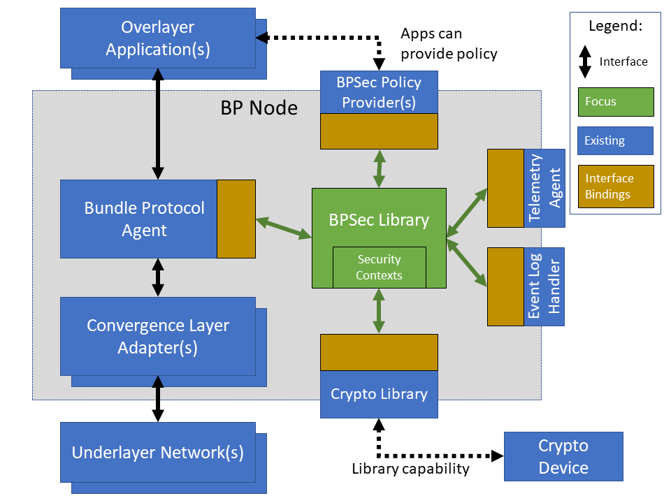

////
Copyright (c) 2023-2026 The Johns Hopkins University Applied Physics
Laboratory LLC.

This file is part of the Bundle Protocol Security Library (BSL).

Licensed under the Apache License, Version 2.0 (the "License");
you may not use this file except in compliance with the License.
You may obtain a copy of the License at
    http://www.apache.org/licenses/LICENSE-2.0
Unless required by applicable law or agreed to in writing, software
distributed under the License is distributed on an "AS IS" BASIS,
WITHOUT WARRANTIES OR CONDITIONS OF ANY KIND, either express or implied.
See the License for the specific language governing permissions and
limitations under the License.

This work was performed for the Jet Propulsion Laboratory, California
Institute of Technology, sponsored by the United States Government under
the prime contract 80NM0018D0004 between the Caltech and NASA under
subcontract 1700763.
////
= Bundle Protocol Security Library (BSL) v2.0 Product{nbsp}Guide
:doctype: book
:backend: docbook5
:docinfo: shared
:toc:

== Introduction

This Product Guide provides architectural and maintenance details about the Bundle Protocol Security Library (BSL), which is part of the NASA Advanced Multi-Mission Operations System (AMMOS) suite of tools.

=== Identification

[%header,width=75%,cols=2*]
|===
|Property
|Value

|Configuration ID (CI)
|681.4

|Element
|Systems Engineering Office (SEO)

|Program Set
|Bundle Protocol Security Library (BSL)

|Version
|2.0
|===

=== Scope

This document describes technical details about the BSL installation, upgrade, monitoring, and maintenance.
For details about the logical structure, workflows, and application programming interface (API) of the BSL see the <<bsl-user-guide>>.

=== Terminology

The following are Generic terms:

Application Programming Interface (API)::
The programming language-level interface defined by a library.
For the C-language this is defined by header files in a specific directory structure.
Application Binary Interface (ABI)::
A combination of instruction set architecture (ISA) and operating-system-specific binary forms for libraries and executables.
A built library has a specific ABI that can be different on different platforms even if its API does not change.
Concise Binary Object Representation (CBOR)::
A binary encoding defined in <<RFC8949>> which follows a superset of the JSON data model (see below) and enables both small encoded size as well as efficient encoding and decoding.
The BSL itself uses CBOR to encode the contents of BPSec ASBs.
JavaScript Object Notation (JSON)::
A text encoding defined in <<RFC8259>> which allows a limited data model to be encoded in a human-readable form.
The BSL does not use JSON directly, but the example ION-heritage Policy Provider uses JSON for encoding policy configuration.
JSON Web Key (JWK)::
A JSON data structure defined in <<RFC7517>> which represents a set of cryptographic keys and their parameters.
The BSL does not use JWK directly, but the Mock BPA uses JWK for its key store configuration.

[#list-terms-bpsec]
The following are BP- and BPSec-related terms:

Bundle Protocol (BP)::
The overlay network protocol used to transport BPSec blocks and target blocks between nodes defined in <<RFC9171>>.
Bundle Protocol Security (BPSec)::
The mandatory-to-implement security mechanism to protect blocks of a BP bundle defined in <<RFC9172>>.
This is the principal scope of behavior implemented in the BSL.
BP Agent (BPA)::
The instantiation of a BP node with a unique administrative Endpoint ID.
A single BPA may have any number of additional endpoints registered to various applications on its node.
BP Endpoint::
The source or destination of a BP bundle, identified by a BP Endpoint ID (EID).
BP Endpoint ID (EID)::
The identifier of a BP Endpoint; names the source and destination for a BP bundle.
Bundle (per BPv7)::
The protocol data unit of Bundle Protocol, which uses a CBOR-encoding of its data.
Block (per BPv7)::
Each sub-element of a bundle.
All bundles contain a mandatory primary block, any number of extension blocks, and a mandatory payload block.
Each extension block has an explicit block type identifier.
Block-Type-Specific Data (BTSD)::
The arbitrary-length binary data containing the contents of a block which is block-type-specific.
Block Integrity Block (BIB)::
A well-known block type used for integrity operations in BPSec.
Block Confidentiality Block (BCB)::
A well-known block type used for integrity operations in BPSec.
Abstract Security Block (ASB)::
A the block-type-specific data for one of the security block types: BIB or BCB, which contains an encoded CBOR sequence.
Security Operation (per BPSec)::
A single security operation is a combination of choosing a type of security (integrity or confidentiality), a single role, a single target (block), a single security context, and a set of options that are context-specific.
Role (per BPSec)::
This determines the action of a security operation, as one of:
Source::: This role causes a security operation to be added to a security block.
Verifier::: This role verifies, but does not modify, a security operation within a security block.
Acceptor::: This role verifies and then removes a security operation within a security block.
Security Context (per BPSec)::
Each security operation has a single associated BPSec context, identified by its Context ID.
Context IDs can either be well-known, and registered with IANA, or taken from a reserved block for private or experimental use.
Target (per BPSec)::
Each security operation has a single target block identified by its unique-to-the-bundle block number.
Parameter (per BPSec)::
Each security block (the entire ASB) has a set of parameters which apply to all operations in the block.
Result (per BPSec)::
Each target of a security block has a set of results which apply to a single operation associated with one target.

[#list-terms-bsl]
The following are BSL-specific terms:

BSL Context::
An container of state and memory allocation for each instance of the BSL.
Each BSL context is not thread safe, it must be used within a single thread exclusively.
Bundle Context::
A container of state and memory allocation for each bundle being processed by a BSL Context.
Policy Provider (PP)::
An abstract interface (and a C callback descriptor struct) for providing security policy to a BSL Context.
The BSL dynamic backend contains a run-time-variable PP registry.
Security Context (SC)::
An abstract interface (and a C callback descriptor struct) for providing BPSec security context processing to a BSL Context.
The BSL dynamic backend contains a run-time-variable SC registry.
Security Action::
Each action contains an ordered sequence of security operations and their internal configuration.
PPs produce sets of actions when inspecting a bundle and operate on the same set of actions when finalizing a bundle.
Security Option::
An option is an internal-to-BSL item which communicates intent for a single Security Operation between PP and SC.

=== References

.Applicable JPL Rules Documents
[%header,cols="<.<3,>.<1"]
|===
|Title
|Document Number

|[[jpl-sd,JPL SD]]Software Development
|57653 rev 10

|===

.Applicable MGSS Documents
[%header,cols="<.<3,>.<1"]
|===
|Title
|Document Number

|[[mimtar,MIMTaR]]MGSS Implementation and Maintenance Task Requirements (MIMTaR)
|DOC-001455 rev I

|[[bsl-sdd,BSL SDD]]BSL Software Design Document (SDD)
|DOC-005834

|[[bsl-srd,BSL SRD]]BSL Software Requirements Document (SRD)
|https://github.com/NASA-AMMOS/BSL-docs/blob/main/BSL%20Software%20Requirements%20Document.pdf[DOC-005735]

|[[bsl-sis,BSL SIS]]BSL Software Interface Specification (SIS)
|https://nasa-ammos.github.io/BSL/html/bsl-sis.html[DOC-005835]

|[[bsl-user-guide,BSL User Guide]]BSL v2.0 User Guide
|https://nasa-ammos.github.io/BSL-docs/user-guide/bsl-user-guide.pdf[DOC-005922]

|===

.Applicable Other Documents
[%header,cols="<.<3,>.<1"]
|===
|Title
|Reference

|[[bsl-source]]BSL Source
|https://github.com/NASA-AMMOS/BSL[GitHub project BSL]

|[[bsl-docs]]BSL Documentation Source
|https://github.com/NASA-AMMOS/BSL-docs[GitHub project BSL-docs]

|[[bsl-main-api,BSL API Docs]]BSL API Documentation -- Main Branch
|https://nasa-ammos.github.io/BSL/html/[GitHub Pages for BSL]

|[[C99]]Programming Languages -- C
|ISO/IEC 9899:1999

|[[POSIX]]IEEE Standard for Information Technology - Portable Operating System Interface (POSIX(R))
|https://pubs.opengroup.org/onlinepubs/9699919799.2008edition/[IEEE Std 1003.1-2008]

|[[fips-140,FIPS 140-3]]Security Requirements for Cryptographic Modules
|https://csrc.nist.gov/pubs/fips/140-3/final[NIST FIPS 140-3]

|[[rhel9-selinux]]Using SELinux
|https://access.redhat.com/documentation/en-us/red_hat_enterprise_linux/9/pdf/using_selinux/red_hat_enterprise_linux-9-using_selinux-en-us.pdf[RHEL9 SELinux Documentation]

|[[rhel9-packaging]]Packaging and distributing software
|https://docs.redhat.com/en-us/documentation/red_hat_enterprise_linux/9/pdf/packaging_and_distributing_software/Red_Hat_Enterprise_Linux-9-Packaging_and_distributing_software-en-US.pdf[RHEL9 Packaging Documentation]

|[[fedora-packaging]]Fedora Packaging Guidelines
|https://docs.fedoraproject.org/en-US/packaging-guidelines/[Fedora Packaging Documentation]

|[[MLIB]]M*LIB: Generic type-safe Container Library for C language
|https://github.com/P-p-H-d/mlib[GitHub project for M*LIB]

|[[QCBOR]]QCBOR Library
|https://github.com/laurencelundblade/QCBOR[GitHub project for QCBOR]

|[[OpenSSL]]OpenSSL Library
|https://openssl-library.org/[OpenSSL Project]

|[[Jansson]]Jansson Library
|https://github.com/akheron/jansson[GitHub project for Jansson]

|[[unity-test]]Unity Test Library
|https://github.com/ThrowTheSwitch/Unity[GitHub project Unity]

|[[NASA-ION]]NASA Interplanetary Overlay Networking (ION) software
|https://github.com/nasa-jpl/ION-DTN/[GitHub project for ION-DTN]

|[[CMake]]CMake Reference Documentation
|https://cmake.org/cmake/help/v3.26/index.html[CMake Project]

|[[pkg-config]]Guide to pkg-config
|https://people.freedesktop.org/~dbn/pkg-config-guide.html[Freedesktop Project]

|[[Ninja]]The Ninja build system
|https://ninja-build.org/manual.html[Ninja manual]

|[[tito]]Tito: A tool for managing rpm based git projects
|https://github.com/rpm-software-management/tito[GitHub project Tito]

|[[wireshark]]Wireshark Project
|https://www.wireshark.org/

|[[RFC7517]]JSON Web Key (JWK)
|https://www.rfc-editor.org/info/rfc7517[IETF RFC 7517]

|[[RFC8259]]The JavaScript Object Notation (JSON) Data Interchange Format
|https://www.rfc-editor.org/info/rfc8259[IETF RFC 8259]

|[[RFC8949]]Concise Binary Object Representation (CBOR)
|https://www.rfc-editor.org/info/rfc8949[IETF RFC 8949]

|[[RFC9171]]Bundle Protocol Version 7
|https://www.rfc-editor.org/info/rfc9171[IETF RFC 9171]

|[[RFC9172]]Bundle Protocol Security (BPSec)
|https://www.rfc-editor.org/info/rfc9172[IETF RFC 9172]

|[[RFC9173]]Default Security Contexts for Bundle Protocol Security (BPSec)
|https://www.rfc-editor.org/info/rfc9173[IETF RFC 9173]

|[[draft-ietf-dtn-bpsec-cose]]Bundle Protocol Security (BPSec) COSE Context
|https://datatracker.ietf.org/doc/draft-ietf-dtn-bpsec-cose/[draft-ietf-dtn-bpsec-cose]

|===

[#sec-arch]
== BSL Architecture

The BSL is purposefully designed to be a software library independent of any specific Bundle Protocol Agent (BPA) implementation and runtime environment.
It is intended to be linked to and used by a BPA during runtime to process BPSec security blocks according to local security policy.

The location of the BSL as a subsystem within a BP Node, operated by a BPA is shown in <<fig-bsl-system-context>>.
The interactions between the BSL and BPA are twofold: calls into the BSL to provide its security services, and calls from BSL into the BPA to provide agent, bundle, and block data and metadata.

Additionally, BSL security services are needed at four distinct points during bundle processing procedures within the BPA.
These are depicted in <<fig-bsl-interaction-points>> and correspond to the following 

* After bundle creation from an application source, augmenting the Transmission procedure of <<RFC9171>>.
* Before bundle delivery to an application destination, augmenting the Delivery procedure of <<RFC9171>>.
* After bundle reception via a CLA, augmenting the Reception procedure of <<RFC9171>>.
* Before bundle forwarding via a CLA, augmenting the Forwarding procedure of <<RFC9171>>.

[#fig-bsl-system-context]
.BSL System Context

[#fig-bsl-interaction-points]
.Interaction Points from the BPA into BSL
graphviz::images/bsl-interaction-points.gv[format=svg,width=140mm]

[#sec-arch-components]
=== BSL Components

The BSL source is separated into several different components, each of which is explained in detail in the inline API Documentation <<bsl-main-api>>.
A summary of the components is below.

BSL Frontend::
This is library artifact `bsl_front`.
A C99 library used by a BPA integration and used by each Policy Provider and Security Context to access BSL and BPA behavior and data.
This is the base of the BSL and is intended to be common for all deployments.
Dynamic Backend::
This is library artifact `bsl_dynamic`.
An implementation of the frontend suitable for general-purpose, non-constrained deployments which uses heap-allocated, dynamically-sized data structures and runtime registration of policy providers and security contexts.
The backend binding to the host BPA is controlled through callbacks registered during BSL startup.
This component can be replaced by a deployment-specific alternative if needed.
Sample Policy Provider::
This is library artifact `bsl_sample_pp`.
An implementation of a configurable policy provider based on the syntax and semantics of the BPSec configuration from the NASA ION software suite <<NASA-ION>>.
Default Security Contexts::
This is library artifact `bsl_default_sc`.
Implementations of the two Default Security Contexts (Context ID 1 and 2) from <<RFC9173>> using the cryptographic interface of the BSL crypto library.
COSE Context::
This is library artifact `bsl_cose_sc`.
An implementation of the COSE Context (Context ID 3) from <<draft-ietf-dtn-bpsec-cose>> using the cryptographic interface of the BSL crypto library.
BSL Crypto Library::
This is library artifact `bsl_crypto`.
An API for security contexts to isolate themselves from cryptographic processing and key handling.
The default configuration uses <<OpenSSL>> to implement this library, which allows the BSL to operate in <<fips-140>> environments.
The key store behavior is controlled through callbacks registered during BSL startup.
Test Utilities::
This is library artifact `bsl_test_utils`.
A set of additional utility functions helpful for unit and fuzz testing but not needed by the operational BSL components.
Mock BPA::
This is library artifact `bsl_mock_bpa` and executable `bsl-mock-bpa`.
An executable used to provide a test fixture and example BPA integration.
This Mock BPA does not provide any of the normal processing required of a real BPA by <<RFC9171>>, it is limited to decoding and encoding BPv7 protocol data unit (PDU) byte strings, processing specific BPv7 primary block fields, providing BSL-required integration callbacks, and calling into the BSL for each bundle being processed at each interaction point.

These components are represented as targets (libraries and executables) in the diagram of <<fig-bsl-targets>>, showing external dependency artifacts, and <<fig-bsl-targets-noext>>, which hides externals to highlight just the BSL artifacts.
These graphs are auto-generated from the BSL CMake project using the build target `graphviz` and have a symbol legend in <<fig-cmake-legend>>.

[#fig-bsl-targets]
.CMake-Generated Target Graph including external artifacts
graphviz::images/dep_chart.dot[format=svg,width=180mm,pdfwidth=100%]

[#fig-bsl-targets-noext]
.CMake-Generated Target Graph excluding external artifacts
graphviz::images/dep_chart_noext.dot[format=svg,width=100mm]

[#fig-cmake-legend]
.CMake Graph Legend
graphviz::images/dep_chart_legend.dot[format=svg,width=120mm]

[#sec-arch-envs]
=== Build and Runtime Environments

The basic requirements in the <<bsl-srd>> are that the build environment use a C compiler, with its standard headers and libraries <<C99>>, and include POSIX headers and libraries <<POSIX>>.

The BSL dynamic backend uses the <<MLIB>> library for heap-allocated data containers, including dynamic arrays, linked lists, sorted trees, and hash maps.
The BSL backend uses the <<QCBOR>> library for encoding and decoding of ASB sequences within security blocks.

The example JSON-based ION-heritage policy provider and Mock BPA JWK registration tool distributed with the BSL both use the <<Jansson>> library for JSON parsing.

The example security contexts distributed with the BSL uses the <<OpenSSL>> library for all cryptographic functions.

The Mock BPA distributed with the BSL uses POSIX UDP/IP sockets for BPv7 PDU transport, both as a test CLA and a test application interface.
This allows traffic into and out of the Mock BPA to be captured by tools such as `pcap` and inspected with tools such as Wireshark and `tshark` <<wireshark>>.
The Mock BPA also uses <<QCBOR>> for encoding and decoding of whole bundle PDUs, as well as the <<Jansson>> library for decoding JWK key stores.

Unit tests for each of the BSL components use the <<unity-test>> library for defining test fixtures and assertion logic.

The entire BSL repository tree is managed using the <<CMake>> tool and by default is configured to use the <<Ninja>> build tool.
The official releases of the BSL use default CMake options, but developers can use other options as described in <<sec-proc-build-devel-cmake>>.

=== Software Packaging

The official releases of the BSL are packaged and distributed as RPM packages intended to be usable within a YUM/DNF repository <<rhel9-packaging>>.
Packages are version marked based on the latest git tag in the working copy's commit history and revision marked based on the specific latest git commit hash of the working copy along with the distribution tag (see the "Versioning" and "Dist Tag" sections of <<fedora-packaging>>).

For example, a pre-release build of the BSL is marked with RPM version-revision of `0.0.0-0.g71ab437.el9` indicating it does not follow a release version tag (so gets marked with version `0.0.0`), it is zero commits from that (non-)tag, it is from commit hash `71ab437`, and it was built on RHEL-9 (or equivalent).

BSL packages can also built from the source tree, either under RHEL-9 directly or using a (Docker or Podman) container to provide an RHEL-9 environment.
Details on these procedures are provided in <<sec-proc-build-pkg>>.

The set of packages for each BSL release (or local package build) contains the following:

`bsl`::
The runtime files needed for the library itself.
This contains versioned shared objects.
+
Major files are installed under `/usr/lib64/`.
`bsl-devel`::
Development files needed to build and link against the BSL.
This contains C headers and shared object version links.
+
Major files are installed under `/usr/include/` and `/usr/lib64/`.
`bsl-apidoc`::
Doxygen-generated API documentation derived from in-source markup.
+
Major files are installed under `/usr/share/doc/bsl/`, which contains an `html` directory.
`bsl-debuginfo`::
Runtime debug information for the `bsl` package.
This relies on `bsl-debugsource` for tracing to individual source lines for interactive debugging.
`bsl-debugsource`::
Copies of the original source files used along with the `*-debuginfo` packages to support interactive debugging.
`bsl-test`::
Unit test and Mock BPA executables and support libraries.
+
Major files are installed under `/usr/bin/`, containing the `bsl-mock-bpa` daemon executable, `/usr/lib64/` for its libraries, and `/usr/libexec/bsl/` which contains each unit test executable for the BSL.
`bsl-test-devel`::
Development files needed to build and link against the Mock BPA of the BSL.
This contains C headers and shared object version links, including the Unity test library.
+
Major files are installed under `/usr/include/` and `/usr/lib64/`.
`bsl-test-debuginfo`::
Runtime debug information for the `bsl-test` package.
This relies on `bsl-debugsource` for tracing to individual source lines for interactive debugging.

[#sec-arch-filesystem]
=== File System

The BSL itself does not require any specific input or configuration files for its normal operation.
It relies on the host BPA to perform any configuration file management, loading, parsing, _etc._.

As a Linux shared library, it does relate to the host file system in the following paths:

`/usr/lib64/`::
The OS-standard path for all shared library files.
The BSL installs its core and example libraries here.
`/usr/lib64/pkgconfig/`:::
A directory containing pkg-config control files <<pkg-config>> for the BSL components.
The pkg-config names installed are `bsl` for the BSL frontend, backend, and crypto libraries, `bsl-default-sc` and `bsl-cose-sc` for the security context implementations, and `bsl-sample-pp` for the sample policy provider.
`/usr/lib64/cmake/`:::
A directory containing CMake control files <<CMake>> for BSL components.
The BSL installs its CMake control files as "config" packages usable with the CMake command `find_package()`.
`/usr/include/`::
The OS-standard path for all library header files.
The BSL installs its own headers under the `bsl` sub-directory, and its inbuilt (non-OS) dependencies under `qcbor` and `m-lib` sub-directories.
`/usr/bin/`::
The OS-standard path for all non-privileged executable files.
The BSL installs its Mock BPA as the executable `bsl-mock-bpa` here.
`/usr/libexec/`::
The OS-standard path for context-dependent executable files.
The BSL installs its unit tests under the `bsl` sub-directory.

[#sec-arch-networking]
=== Networking

The BSL itself does not require any specific OS networking configuration or API interfaces.
It relies on the host BPA to perform any network configuration or runtime use.

The Mock BPA distributed with the BSL uses UDP/IP sockets, configured by command-line options, to communicate bundles into and out of the Mock BPA process (see <<sec-proc-monitoring>>).

[#sec-arch-crypto]
=== Cryptographic Functions

The BSL itself does not require any specific OS or middleware cryptographic functions.

The example implementation of the default security contexts distributed with the BSL uses the <<OpenSSL>> library for performing all cryptographic functions.

[#sec-proc]
== Procedures

This chapter includes specific procedures related to managing an BSL deployment from source and for development of BSL changes.

[#sec-proc-build-pkg]
=== Building Packages

The BSL source is composed of a top-level repository `BSL` <<bsl-source>> and a number of submodule repositories; all of them are required for building the BSL.

The following procedure is targeted for the RHEL-9 environment, where the variable `TAGNAME` is a placeholder for the actual git tag name being used.
Other conditions and procedures are discussed in more detail in the source repository `README.md` document.

. The top-level checkout can be done with:
+
[source,bash]
----
git clone --recursive --branch ${TAGNAME} https://github.com/NASA-AMMOS/BSL.git
----
. Optional: switching to a different tag or branch can be done with the sequence:
+
[source,bash]
----
git checkout ${TAGNAME}
git submodule update --init --recursive
----
. If necessary, dependency OS packages can be installed with:
+
----
sudo dnf install -y 'dnf-command(config-manager)' epel-release
sudo dnf config-manager --set-enabled crb
sudo dnf install -y \
    rsync cmake git ninja-build gcc ruby \
    openssl-devel jansson-devel valgrind-devel \
    doxygen graphviz plantuml texlive-bibtex \
    asciidoctor \
    tito rpm-build rpmlint
----
The packages `doxygen graphviz plantuml texlive-bibtex asciidoctor` are optional, and used only for the `bsl-docs` subpackage.
. The BSL packages are then built (using the Tito packaging tool <<tito>>) with:
+
----
./build.sh rpm-build
----
. The resulting packages are placed in the directory `build/default/pkg` and can be seen by the listing:
+
[source,bash]
----
find build/default/pkg/rpmbuild -name '*.rpm'
----
. Optionally: A check and test install of the packages can be performed using:
+
----
./build.sh rpm-check
----

An alternative to the procedure for building on an RHEL host is to build within a container with an RHEL base image.
This can be done using the following on any host with docker available using the command:

----
./build.sh rpm-container
----

With package files copied into the same `build/default/pkg` as the native build.
The specific docker executable is configured through the `DOCKER` environment.

[#sec-proc-install]
=== Installation

Once packages are built locally, they can all be installed by running:
[source,bash]
----
pushd build/default/pkg/rpmbuild/RPMS/x86_64
dnf install -y bsl-*.rpm
popd
----
Or by some more discriminate choice of packages, such as only the two necessary to integrate the BSL library: `bsl bsl-devel`

Or if pre-built packages are available on an enabled YUM/DNF repository, they can be installed (more simply by name) using:
[source,bash]
----
dnf install -y bsl bsl-devel
----

Once installed, the BSL library can be linked with and built against as any other OS-installed C library.

[#sec-proc-upgrade]
=== Upgrading

Because the BSL is deployed in an RPM package form, the normal operating system tools and procedures for dealing with software library upgrading apply to the BSL.
The BSL provides SOVERSION information in its libraries, so RPM management tools such as DNF which are cross-dependence-aware will ensure that the correct needed SOVERSION of the BSL is installed.

Individual BSL releases may identify pre-upgrade or post-upgrade steps in their specific Release Description Document (RDD) which would augment this OS-standard procedure.

[#sec-proc-build-devel]
=== Development Building

When modifying the BSL itself (or its Sample Policy Provider, Security Context implementations, or the Mock BPA) a more varied set of procedures is necessary, because RPM packages are not used as intermediate forms because of the time and resources it takes to build them and the separation they then have from the original BSL sources.

[#sec-proc-build-devel-cmake]
==== CMake Project Options

The BSL CMake Project has several options to control what and how the components of the project are build, tested, and installed.

Some https://cmake.org/cmake/help/v3.26/manual/cmake-variables.7.html[built-in CMake options] which are useful for development are:

`CMAKE_PREFIX_PATH`::
Path specification to use for searching for external libraries and CMake packages.
The BSL build script sets this to the local tree `./testroot/` which is where the dependencies are installed by default.
`CMAKE_INSTALL_PREFIX`::
Path specification to use for installing the BSL libraries, executables, documentation, and other files.
The BSL build script sets this to the local tree `./testroot/` by default.
`CMAKE_BUILD_TYPE`::
Choose between standard types "Debug", "Release", "RelWithDebInfo"
The BSL build script uses build type Debug, while the RPM spec builds packages with the RPM-default type.
`BUILD_SHARED_LIBS`::
Build using shared libraries (default ON)

The BSL-specific options (defined at the top of the root `CMakeLists.txt`) are:

`BUILD_LIB`:: Build the library itself (default ON). This will require all normal dependencies of the BSL.
`BUILD_DOCS_API`:: Enable API documentation building (default OFF). This will require the doxygen tool to be installed.
`BUILD_DOCS_MAN`:: Enable manpage building (default OFF). This will require the asciidoctor tool to be installed.
`BUILD_MOCK_BPA`:: Enable building the Mock BPA library and executable (default ON).
`BUILD_UNITTEST`:: Enable building unit tests (default ON).
`TEST_MEMCHECK`:: Enable test runtime memory checking (default ON). This will require the valgrind tool to be installed.
`BUILD_COVERAGE`:: Enable runtime coverage logging and reporting (default OFF). This will require the gcovr tool to be installed.
`BUILD_FUZZING`:: Enable building fuzzing executables (default OFF). This will cause unit tests to be disabled.
`BSL_LOG_PLAINTEXT_ENABLE`:: Enable debug logging of internal state, which will leak secrets in log events and should be used only for test builds.

[#sec-proc-build-devel-build]
==== Local Building and Testing

The coarse-grained procedure for building and testing the BSL locally is the following, based on a working copy of the BSL repository and starting shell commands within that working copy root directory.

. Build the local dependencies an install into the local target tree `./testroot/` using:
+
----
./build.sh deps
----
. Prepare the CMake project, with optional additional options, using:
+
----
./build.sh prep -DBUILD_COVERAGE=ON
----
One option available to control the installation is the standard `CMAKE_INSTALL_PREFIX` (see <<sec-proc-build-devel-cmake>>).
. Build the artifacts into the out-of-source tree `./build/default/` using:
+
----
./build.sh
----
. Install artifacts into the local target tree `./testroot` using:
+
----
./build.sh install
----
If a non-default install prefix is used, this install command may need to be run under `sudo`.
. Optionally, execute registered unit tests using:
+
----
./build.sh check
----
.. If BSL sources are updated and need re-testing, they must be built-and-installed using:
+
[source,bash]
----
./build.sh && ./build.sh install
----
. Optionally, execute Mock BPA built-item tests using the following sub-procedure.
.. Install and enter a local Python virtualenv using:
+
----
python3 -m venv venv
source venv/bin/activate
pip install -r mock-bpa-test/requirements.txt
----
.. Run the test suite using:
+
----
python3 -m pytest mock-bpa-test --log-cli-level=info
----
.. If BSL sources are updated and need re-testing, they must be built-and-installed using:
+
----
./build.sh && ./build.sh install
----
.. Leave the virtualenv using:
+
----
deactivate
----
. Collect and report on coverage metrics using:
+
----
./build.sh coverage
./build.sh coverage-summary
----
. The coverage outputs under the build tree can be viewed in a Web Browser using:
+
----
xdg-open build/default/coverage-html/index.html
----

[#sec-proc-build-devel-apidoc]
==== Local API Documentation Building

The full API documentation can be built and edited locally using the following procedure.

. Build the local dependencies (the same as a normal build) using:
+
----
./build.sh deps
----
. Prepare the CMake project, with options to enable API documentation building, using:
+
----
./build.sh prep -DBUILD_DOCS_API=ON
----
. Build the documentation itself, observing warnings, using:
+
----
./build.sh docs
----
. The documentation outputs under the build tree can be viewed in a Web Browser using:
+
----
xdg-open build/default/docs/api/html/index.html
----

[#sec-proc-bpabuild]
=== Compiling and Linking with BSL

The RPM packages for BSL contain both CMake and `pkg-config` control files to allow user applications to compile and link with the various BSL libraries (see <<sec-arch-components>>).
Using these control files, which ones and how to use them, depends on the build system from which the user is linking.
Two common examples are explained in the following subsections.

==== General Requirements on BPA Environment

As explained in <<sec-arch-envs>> the BSL is designed to be used in a C99 and POSIX environment.

It is a build configuration matter for the BPA to ensure that it compiles with at least C99 compatibility.

Part of the BSL interface related to log events (both generating events through the frontend and handling events via callbacks) requires the use of `struct timespec` defined by POSIX headers.
This means that BPA hosts linking in the BSL need to themselves support some version of POSIX no earlier than the 2008 compatibility version needed by BSL.

As defined by <<POSIX>> itself, the compile-time configuration to enable this compatibility is a preprocessor define set similar to the following
----
-D_POSIX_C_SOURCE=200809L
----

==== Linking From a CMake Project

The most straightforward way to compile and link with the BSL is from another CMake project.
An example of this use is included in the BSL source tree in the file `lib-user-test/CMakeLists.txt`.

In this case, the only configuration needed in that project is to use a CMake command similar to the following, which will search based on the `CMAKE_PREFIX_PATH` option (and other environment variables).
----
find_package(bsl CONFIG REQUIRED)
----

If successful, this command will import each of the BSL target libraries under the `bsl` namespace.
The CMake targets in this namespace are
`bsl::bsl_front`,
`bsl::bsl_dynamic`,
`bsl::bsl_crypto`,
`bsl::bsl_sample_pp`,
`bsl::bsl_default_sc`, and
`bsl::bsl_cose_sc`.
Each target uses the similarly named BSL library.

The BPA then just needs to link with the appropriate namespaced targets similar to the following command, which uses the placeholder target `my_bpa`.
----
target_link_libraries(my_bpa PUBLIC bsl::bsl_front bsl::bsl_crypto)
----

Depending on which BSL targets are being linked with, the CMake project may also need to find packages associated with the targets `MLIB::mlib` and/or `qcbor::qcbor` (see <<fig-bsl-targets>>).
The BSL frontend and crypto libraries do not depend on these external targets.

==== Linking From an Autotools Project

If the BPA does not use CMake, then any builder which can make use of `pkg-config` control files can build with the installed BSL.
An example of this use with GNU autotools is included in the BSL source tree in the files `lib-user-test/configure.ac` and `lib-user-test/Makefile.am`.

In this case the `pkg-config` executable will be used to search for the BSL packages based on the `PKG_CONFIG_PATH` environment.
If needed, the install prefix can be overridden using the option `--define-prefix` or `--define-variable=prefix=${PREFIX}`.

The `pkg-config` packages (one per `.pc` control file) installed with BSL are:

`bsl`::
Use the `bsl_front`, `bsl_dynamic`, and `bsl_crypto` libraries.
`bsl-sample-pp`::
Use the `bsl_sample_pp` library, and depends on `bsl-default-sc` and `bsl-cose-sc` packages.
`bsl-default-sc`::
Use the `bsl_default_sc` library, and depends on `bsl` package.
`bsl-cose-sc`::
Use the `bsl_cose_sc` library, and depends on `bsl` package.

[#sec-proc-monitoring]
=== Monitoring

The BSL itself, as a software library, does not directly make use of any OS-level logging or monitoring facilities.

As discussed more in the BPA integration portion of the <<bsl-user-guide>>, one form of monitoring output from the BSL is its log events and another form is polling for BSL telemetry counters.

Because the Mock BPA uses "normal" BPv7/UDPCL it can be monitored using off-the-shelf Wireshark since version 4.0 <<wireshark>> with the protocol "BPv7" enabled, and the appropriate UDP ports used by the Mock BPA set to "Decode As..." for BPv7.

An example of starting wireshark with this kind of configuration is the following command.
[source,bash]
----
wireshark -i lo -k \
    -f 'udp port 4556 or udp port 14556 or udp port 24556 or udp port 34556' \
    -d 'udp.port==4556,bundle' -d 'udp.port==14556,bundle' \
    -d 'udp.port==24556,bundle' -d 'udp.port==34556,bundle' \
    -Y bpv7
----

[#sec-proc-mon-selinux]
==== SELinux Audit Events

The procedures in this section are a summary of more detail provided in Chapter 5 of the RedHat <<rhel9-selinux>> document.

By default, the `setroubleshootd` service is running, which intercepts SELinux audit events

To observe the system audit log in a formatted way run:
[source,bash]
----
sudo sealert -l '*'
----

Some SELinux denials are marked as "don't audit" which suppresses normal audit logging when they occur.
They are often associated with network access requests which would flood an audit log if they happen often and repeatedly.
To enable logging of `dontaudit` events run:
[source,bash]
----
sudo semanage dontaudit off
----

==== FIPS-140 Denials

The effect of FIPS-140 enforcement and denied behavior appear as 'normal' failures of the corresponding cryptographic API and must be observed from logs of the BSL or of the cryptographic library itself.
Because the BSL operates as a library, its logging is routed through the callback API to its host application (_i.e._ the BPA).
Determining how to access the host application logs is outside the scope of this guide.

[#sec-checkout]
=== Checkout Procedures

==== Library Unit Tests

The BSL packaging procedure includes built unit tests within the `bsl-test` RPM package which allows executing unit tests on the BSL library after build time on any other host.

==== Library Linking Tests

The top `build.sh` includes a sub-command `check-install` which will exercise the installed BSL via both `pkg-config` and CMake means as described in <<sec-proc-bpabuild>>.
These tests use their own control files under the source directory `lib-user-test` to build and link with the BSL just as any other C library.

==== Mock BPA Tests

The `bsl-mock-bpa` executable distributed as part of the `bsl-test` RPM package enables verification of the installed BSL libraries using the Sample Policy Provider and example security contexts and real BPv7 PDUs exchanged via UDP/IP endpoints (equivalent to the un-framed transfer of the UDPCL).

The Mock BPA has a corresponding Python test fixture which exercises the BSL by the short sequence for each test scenario of:

. Starting the Mock BPA with specific policy configuration and key store input files.
. Verifying that the BPA starts up and listens on specific UDP/IP endpoints.
. Send specific input BP PDU(s) to either the application interface (`appin`) or the CLA interface (`clin`).
. Wait for specific output BP PDU(s) from either the application interface (`appout`) or the CLA interface (`clout`).
. Possibly observe specific log events from the BSL to confirm failure modes.

NOTE: When using the Mock BPA it is recommended to bind to `localhost` or any address on an IP interface which has a large MTU.
Binding on or sending to UDP/IP endpoints which have a small corresponding MTU (e.g. the Ethernet default of 1500) will severely constrain the size of PDUs that can be used with the Mock BPA.

All other checkout of the BSL requires a specific BPA integration in order to exercise its _service interface_ from a running BPA instance.

[#sec-support]
== Product Support

There are two levels of support for the BSL: troubleshooting by a system administrator, which is detailed in <<sec-troubleshooting>>, and upstream support via the BSL public GitHub project, accessible as described in <<sec-contact>>.
Attempts to troubleshoot should be made before submitting issue tickets to the upstream project.

[#sec-troubleshooting]
=== Troubleshooting

The following situations provide troubleshooting guidance for the BSL from the perspective of a package maintainer or BSL developer, typically working from a local clone of the BSL git repository.
Each situation consists of an observed state followed by a recommended troubleshooting activity.

==== Building and Continuous Integration

This section covers issues that can occur during packaging (see <<sec-proc-build-pkg>>) or during development (see <<sec-proc-build-devel>>) of the BSL.

[qanda]
Portions of the CMake project are giving errors during preparation::
It is important that all CMake options (see <<sec-proc-build-devel-cmake>>) given at prep time are consistent.
When the same option is supplied on the command multiple times, the last value is the one actually used.

Mock BPA tests are failing inconsistently or due to symbol errors::
Before running Mock BPA tests, the built artifacts must be installed to the `testroot` tree using `./build.sh install`.

Files are not installed where I want them::
This can be controlled with the `CMAKE_INSTALL_PREFIX` option (see <<sec-proc-build-devel-cmake>>) for the BSL itself.
Dependencies also need to be configured by setting the standard `DESTDIR` and `PREFIX` environment variables before running `./build.sh deps`.

The API documentation target complains about misspellings::
If it is a false positive (the word is correctly spelled, just not in the current dictionary) edit the file `docs/api/dictionary.txt` to add the word.

==== Installation

This section covers issues that can occur during installation (see <<sec-proc-install>>) of the BSL.

[qanda]
Permission is denied by YUM/DNF to install packages::
Because the RPM packages are installed to the OS, their use requires privileged user account or the use of `sudo`.

==== Operations

This section covers issues that can occur after successful installation (see <<sec-proc-install>>) and checkout (see <<sec-checkout>>) of the BSL.

[qanda]
Behavior is reported or suspected to be blocked by SELinux::
If there is any behavior of the BSL not working correctly and there is suspicion that it is being blocked because of local SELinux policy, the procedures of <<sec-proc-mon-selinux>> should be used to troubleshoot.

Behavior is reported or suspected to be blocked by FIPS-140 enforcement::
The example security contexts maintained as part of the BSL make use of a FIPS-approved version of OpenSSL with algorithms and security parameters also compliant with FIPS-140.
So these default security contexts should not run afoul of any blocks caused by enabling "FIPS mode" on the host OS.
+
Any additional security contexts registered with a specific BSL instance may not be FIPS-140 compliant and should be carefully considered before use in an expected FIPS-enabled environment.

[#sec-contact]
=== Contacting or Contributing

The BSL is hosted on a GitHub repository <<bsl-source>> with submodule references to several other repositories.
There is a https://github.com/NASA-AMMOS/BSL/blob/main/CONTRIBUTING.md[`CONTRIBUTING.md`] document in the BSL repository which describes detailed procedures for submitting tickets to identify defects and suggest enhancements.

Separate from the source for the BSL proper, the BSL Product Guide and User Guide are hosted on a GitHub repository <<bsl-docs>>, with its own https://github.com/NASA-AMMOS/BSL-docs/blob/main/CONTRIBUTING.md[`CONTRIBUTING.md`] document for submitting tickets about either the Product Guide or User Guide.

While the GitHub repositories are the primary means by which users should submit detailed tickets, other inquiries can be made directly via email to the the support address mailto:dtnma-support@jhuapl.edu[,BSL Support].
