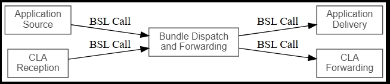
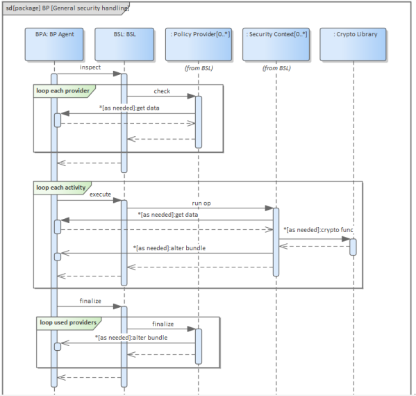

////
Copyright (c) 2023-2025 The Johns Hopkins University Applied Physics
Laboratory LLC.

This file is part of the Bundle Protocol Security Library (BSL).

Licensed under the Apache License, Version 2.0 (the "License");
you may not use this file except in compliance with the License.
You may obtain a copy of the License at
    http://www.apache.org/licenses/LICENSE-2.0
Unless required by applicable law or agreed to in writing, software
distributed under the License is distributed on an "AS IS" BASIS,
WITHOUT WARRANTIES OR CONDITIONS OF ANY KIND, either express or implied.
See the License for the specific language governing permissions and
limitations under the License.

This work was performed for the Jet Propulsion Laboratory, California
Institute of Technology, sponsored by the United States Government under
the prime contract 80NM0018D0004 between the Caltech and NASA under
subcontract 1700763.
////
= Bundle Protocol Security Library (BSL) User Guide
:doctype: book
:backend: docbook5
:docinfo: shared
:toc:

[preface]
== Introduction

This User Guide provides an overview of the application programming interface (API) and high-level workflows of the Bundle Protocol Security Library (BSL), which is part of the NASA Advanced Multi-Mission Operations System (AMMOS) suite of tools.

=== Identification

[%header,width=75%,cols=2*]
|===
|Property
|Value

|Configuration ID (CI)
|681.4

|Element
|Mission Control System (MCS)

|Program Set
|Bundle Protocol Security Library (BSL)

|Version
|1.0
|===

=== Scope

This document describes the API and workflows of the BSL.
For technical details about the BSL architecture, installation, upgrade, monitoring, and maintenance see the <<bsl-product-guide>>.

[glossary]
=== Terminology

[glossary]
Bundle Protocol (BP)::
The overlay network protocol used to transport BPSec blocks and target blocks between nodes.
Bundle Protocol Security (BPSec)::
The mandatory-to-implement security mechanism to protect blocks of a BP bundle.
This is the principal scope of behavior implemented in the BSL.
BP Agent (BPA)::
The instantiation of a BP node with a unique administrative Endpoint ID.
BP Endpoint::
The source or destination of a BP bundle, identified by a BP Endpoint ID (EID).
BP Endpoint ID (EID)::
The identifier of a BP Endpoint; names the source and destination for a BP bundle.
Concise Binary Object Representation (CBOR)::
The data format used to encode Bundle Protocol Bundles.
Host::
A single node on the network and a single instance of an operating system.
One host can have many interfaces and many IP addresses, but only one canonical host name.
JavaScript Object Notation (JSON)::
TBD

=== References

.Applicable JPL Rules Documents
[%header,width=100%,cols="<.<3,>.<1"]
|===
|Title
|Document Number

|Software Development[[jpl-sd,SD]]
|57653 rev 10

|===

.Applicable MGSS Documents
[%header,width=100%,cols="<.<3,>.<1"]
|===
|Title
|Document Number

|MGSS Implementation and Maintenance Task Requirements[[mimtar,MIMTaR]]
|DOC-001455 rev G

|BSL Product Guide[[bsl-product-guide,BSL Product Guide]]
|DOC-TBD

|===

.Applicable Other Documents
[%header,width=100%,cols="<.<3,>.<1"]
|===
|Title
|Reference

|BSL Source[[bsl-source]]
|https://github.com/NASA-AMMOS/BSL[bsl-source]

|BSL Document Source[[bsl-docs]]
|https://github.com/NASA-AMMOS/BSL-docs[bsl-docs]

|===

== Application Programming Interface

The following section provides an overview of the BSL API and references to specific sections of the online API documentation.

=== Introduction

The BSL as a whole is separated into two primary layers of implementation: an API-centric abstract Frontend library and a host-binding concrete Backend library.

The Frontend library provides the service API for the BSL to be called by its associated BPA as needed and for stable public APIs used by Policy Provider implementations and Security Context implementations. The Backend library implements forward-declared structs and functions from the Frontend using specific concrete data containers, algorithms, etc.

Most interactions with the BSL/frontend API occur within the context of a single bundle. There are four points along bundle traversal where BSL interaction from the BPA is necessary:

1. After bundle creation from an application source, indicated by BSL_POLICYLOCATION_APPIN.
2. Before bundle delivery to an application destination, indicated by BSL_POLICYLOCATION_APPOUT.
3. After bundle reception via a CLA, indicated by BSL_POLICYLOCATION_CLIN.
4. Before bundle forwarding via a CLA, indicated by BSL_POLICYLOCATION_CLOUT.

=== Policy Providers (PP)
PPs should be registered with the library context. PPs must implement the function headers of the frontend `PolicyProvider.h` header file. The BSL includes an rule-based example PP that may be utilized.

PPs must inspect each bundle to product a set of security operations (SecOps), and finalize over a bundle after each SecOp has been executed by the security context.

=== Security Contexts (SC)
SCs should be registered with the library context. SCs must implement the function headers of the frontend `SecurityContext.h` header file. The BSL includes two Default SC implementations (specified in RFC9173), `BIB-HMAC-SHA2` (Bundle Integrity) and `BCB-AES-GCM` (Bundle Confidentiality) that may be utilized.

SCs operate in the context of a single SecOp over a bundle3. SCs must validate SecOps for consistency, and process SecOps on bundles to produce security outcomes.

== Workflows

=== Simple Workflow Description
A simple BPA that utilizes the example policy provider, default security contexts, and dynamic backend could operate with the following workflow:

==== Set & Initialize Host Descriptiors
The BSL backend relies on BPA-implementation-specific information from the BPA, such as EID registering/encoding information. The function-pointer fields of a `BSL_HostDescriptors_t` struct should be set with BPA-defined functions and initialize with  with `BSL_HostDescriptors_Set()`.

==== Initialize the Library Context
Each runtime instance of the BSL is isolated for thread safety within a host-specific struct referenced by a `BSL_LibCtx_t` pointer. Each instance should be initialized using `BSL_LibCtx_Init()`.

==== Initialize EIDs
BPAs can register one or more nodes, each of which has a unique endpoint ID (EID). Each EID must be registered with the host with `BSL_HostEID_Init()`.

==== Register Example Policy Provider(s) (PPs) with the Library Context
Register the example PP with the Library Context.

==== Register Default Security Contexts (SCs) with the Library Context
Register `BIB-HMAC-SHA2` and `BCB-AES-GCM` Default SCs with the Library Context.

=== Initialize Bundle Context for each ingress Bundle
For each bundle to be processed through the BPA, create a bundle context to be utilized throughout bundle's interaction with the BSL using the host-specific struct `BSL_BundleCtx_t`.

==== Inspect Bundles with PP(s)
Utilize the example PP's inspect function to create Action Set(s) that contain Security Operations (SecOps).

==== Validate SecOps with SCs
For each action (containing SecOps), utilize the validate function of the relevant Default SC to ensure each SecOp is valid.

==== Execute SecOps with SCs
For each action (containing SecOps), utilize the execute function of the relevant Default SC to perform each SecOp over the bundle. The SC will produce Security Outcomes to be returned to the BPA.

==== Finalize Bundles with PP(s)
TBD

==== Free Bundle Context after Bundle egress
TBD

==== Free LibCtx if BSL no longer required
Each `BSL_LibCtx_t` instance should be de-initialized using `BSL_LibCtx_Deinit()`.

=== Visual Representation of Per-Bundle Workflow

== Product Support

There are two levels of support for the BSL: troubleshooting by a system administrator, which is detailed in <<sec-troubleshooting>>, and upstream support via the BSL public GitHub project, accessible as described in <<sec-contact>>.
Attempts to troubleshoot should be made before submitting issue tickets to the upstream project.

[#sec-troubleshooting]
=== Troubleshooting

TBD

[#sec-contact]
=== Contacting or Contributing

The BSL is hosted on a GitHub repository <<bsl-source>> with submodule references to several other repositories.
There is a https://github.com/NASA-AMMOS/anms/blob/main/CONTRIBUTING.md[`CONTRIBUTING.md`] document in the BSL repository which describes detailed procedures for submitting tickets to identify defects and suggest enhancements.

Separate from the source for the BSL proper, the BSL Product Guide and User Guide are hosted on a GitHub repository <<bsl-docs>>, with its own https://github.com/NASA-AMMOS/anms-docs/blob/main/CONTRIBUTING.md[`CONTRIBUTING.md`] document for submitting tickets about either the Product Guide or User Guide.

While the GitHub repositories are the primary means by which users should submit detailed tickets, other inquiries can be made directly via email to the the support address mailto:dtnma-support@jhuapl.edu[,BSL Support].

[index]
== Index
